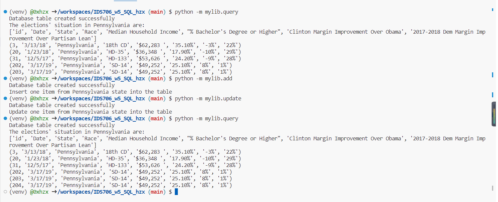

# IDS 706 Week6 Complex SQL

## Purpose
- Design a complex SQL query involving joins, aggregation, and sorting
- Provide an explanation for what the query is doing and the expected results


## Preparation
Create a single database on Azure SQL Database

The AdventureWorksLT database is a sample database provided by Microsoft, primarily used for learning and demonstrating SQL Server and database-related concepts. It is a simplified version of the larger AdventureWorks database, designed for educational purposes and to illustrate database modeling and management techniques.

Here are some key features and details about the AdventureWorksLT database:

1. Schema: It includes a set of tables and relationships that model a fictional company's operations related to products, customers, and sales.

2. Tables: Some of the main tables in the AdventureWorksLT database include:

- SalesLT.Customer: Contains customer information such as names and addresses.
- SalesLT.Product: Stores product details like names, descriptions, and prices.
- SalesLT.SalesOrderHeader: Records information about sales orders, such as order dates and customer IDs.
- SalesLT.SalesOrderDetail: Contains details about products within sales orders, including quantities and prices.

## SQL query
```sql
SELECT
    CONCAT(c.FirstName, ' ', c.LastName) AS CustomerName,
    soh.OrderDate AS PurchaseDate,
    SUM(sod.OrderQty * sod.UnitPrice) AS TotalPurchaseAmount
FROM
    SalesLT.Customer AS c
JOIN
    SalesLT.SalesOrderHeader AS soh ON c.CustomerID = soh.CustomerID
JOIN
    SalesLT.SalesOrderDetail AS sod ON soh.SalesOrderID = sod.SalesOrderID
GROUP BY
    c.CustomerID, c.FirstName, c.LastName, soh.OrderDate
ORDER BY
    TotalPurchaseAmount DESC;

```

## Explanation
This SQL query retrieves customer information, counts the number of orders for each customer, calculates their total purchase amount, and sorts the results based on the total purchase amount in descending order. This provides a ranked list of customers by their spending.

1. **SELECT Clause**:
- We start the query with the `SELECT` clause, which specifies the columns we want to retrieve in the result set.
- In this case, we use the `CONCAT` function to combine the first name and last name of customers into a single column named `CustomerName`.
- We also use the `COUNT` function to calculate the number of orders and the `SUM` function to calculate the total purchase amount.
- These columns will be included in the final result.

2. **FROM Clause**:
- Next, we specify the `FROM` clause, where we define the tables we need for our query.
- We use three tables: `SalesLT.Customer` (aliased as c), `SalesLT.SalesOrderHeader` (aliased as soh), and `SalesLT.SalesOrderDetail` (aliased as sod).
- We join these tables to retrieve customer and order information.

3. **JOIN Clauses**:
- We use JOIN clauses to specify the relationships between the tables.
- The first JOIN links the Customer table (c) with the SalesOrderHeader table (soh) using the CustomerID column.
- The second `JOIN` links the `SalesOrderHeader` table (soh) with the `SalesOrderDetail` table (sod) using the `SalesOrderID` column.
- These joins allow us to connect customer data with order data.

4. **GROUP BY Clause**:
- We apply the `GROUP BY` clause to group the results based on specific columns.
- In this case, we group by `CustomerID`, `FirstName`, and `LastName` from the Customer table.
- Grouping allows us to aggregate data for each unique customer.

5. **Aggregation Functions (COUNT and SUM)**:
- Inside the `SELECT` clause, we use aggregation functions:
  - `COUNT(soh.SalesOrderID)` calculates the number of orders for each customer.
  - `SUM(sod.OrderQty * sod.UnitPrice)` calculates the total purchase amount by multiplying the quantity and unit price of products in each order.

6. **ORDER BY Clause**:
- We use the `ORDER BY` clause to specify the sorting order for the result set.
- We sort the results by `TotalPurchaseAmount` in descending order (`DESC`).
- This means that customers with the highest total purchase amount will appear at the top of the result set.

## Screenshots
The result of SQL query appears as shown below.



