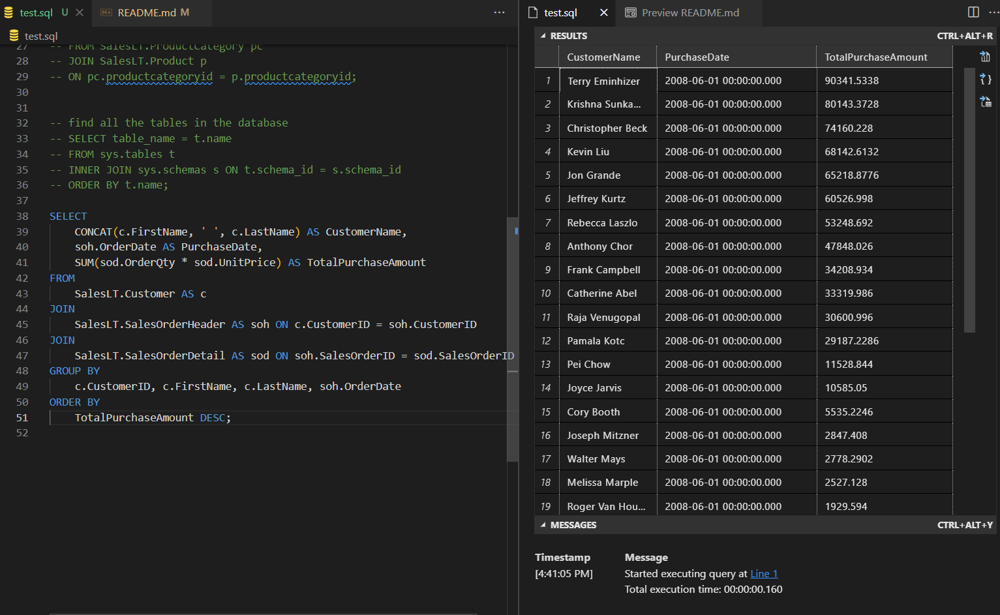

# IDS 706 Week5 SQL

## Purpose
- Connect to a SQL database with sqlite3
- Perform CRUD operations
- Write at least two different SQL queries
- Build an ETL pipeline supporting the queries
- Utilize `pytest` to mock the database connection in memory and test the queries

## Preparation
- Data: Contains data on all elections pitting at least one Democrat against at least one Republican between Jan. 20, 2017, and Mar. 27, 2018, including both state and federal special elections as well as regularly scheduled 2017 elections in New Jersey and Virginia (except for New Jersey General Assembly).
- CI/CD: Use github actions to run the pipeline automatically
- ETL-Query: [E] Extract a dataset from URL, [T] Transform, [L] Load into SQLite Database and [Q] Query For the ETL-Query lab:
  * [E] Extract a dataset from a URL with CSV format.
  * [T] Transform the data by cleaning, filtering, enriching, etc to get it ready for analysis.
  * [L] Load the transformed data into a SQLite database table using Python's sqlite3 module.
  * [Q] Write and execute SQL queries on the SQLite database to analyze and retrieve insights from the data.

## Screenshots
- The result of executing the CRUD operations is shown below:

  
  
- CI/CD Pipeline
    - `make format`
    - `make lint`
    - `make test` only need to test the CRUD functions

